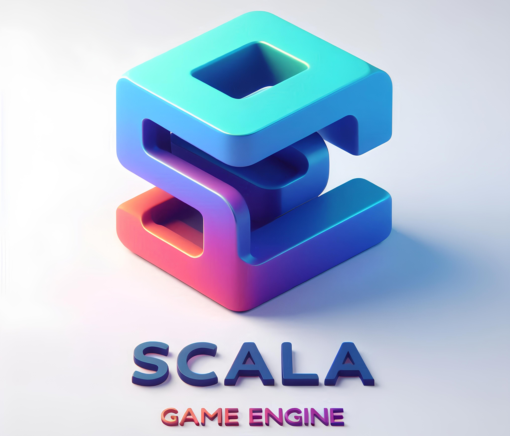
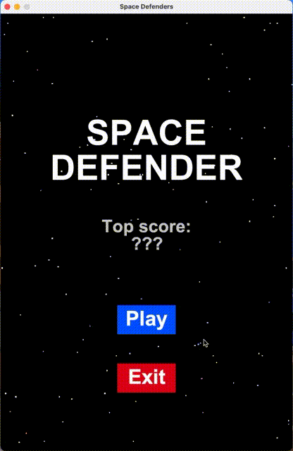
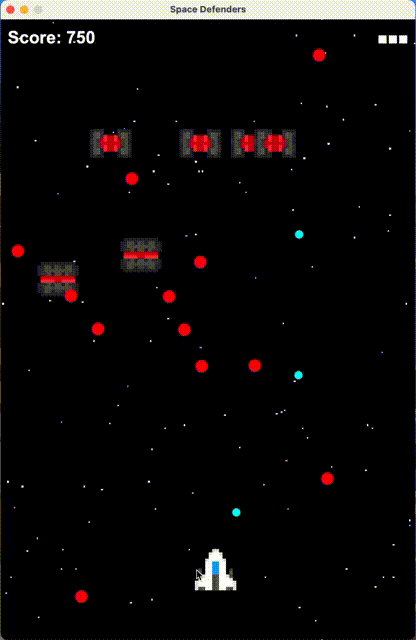

# Scala Game Engine

## Autori
- [Alessandro Venturini](https://github.com/Ventus218)
- [Michele Ravaioli](https://github.com/RavaMichi)
- [Corrado Stortini](https://github.com/Corstor)

## Prova i giochi di esempio!

<!-- I know HTML's align and width are deprecated but that's the olny way to make it work on GitHub too -->

  
  

[Qui](https://github.com/Ventus218/Scala-Game-Engine/releases/latest) si può trovare l'ultima release, i giochi sono compilati in JAR eseguibili:
- SpaceDefender.jar
- StealthGame.jar
- Trump.jar (Briscola)

## Abstract
Si vuole realizzare un semplice game engine.
Inoltre verranno realizzati tre giochi diversi, per dimostrare che il framework sia abbastanza general purpose.

Le caratteristiche di base che verranno fornite sono le seguenti:
- Game loop
- Supporto a più scene
- Input e output
- Design che favorisca l'implementazione all'utilizzatore dei propri oggetti di gioco e relativi comportamenti
- Componenti built-in pronti all'uso

L'intenzione è quella di utilizzare le seguenti caratteristiche peculiari di scala:
- Mixin per realizzare quello che normalmente viene implementato con il pattern Component. In modo da fornire una esperienza di sviluppo più intuitiva.
- DSL per facilitare e rendere più intuitivo il testing dell'engine/game-loop

### Componente funzionale del progetto
Siccome si è deciso di sfruttare i mixin che sono un concetto strettamente legato alla programmazione ad oggetti, per permettere la valutazione delle nostre competenze in ambito di programmazione funzionale ci siamo concentrati nell'adottare questo paradigma nella realizzazione dei giochi piuttosto che nel motore di gioco.

Per questo ognuno dei partecipanti al progetto ha realizzato in maniera totalmente autonoma il proprio gioco.

## Indice
- [Processo di sviluppo](./docs/01_ProcessoSviluppo.md)
- [Requisiti e specifica](./docs/02_RequisitiSpecifica.md)
- [Design architetturale](./docs/03_DesignArchitetturale.md)
- [Design di dettaglio](./docs/04_DesignDettaglio.md)
- [Implementazione](./docs/05_Implementazione.md)
- [Testing](./docs/06_Testing.md)
- [Retrospettiva](./docs/07_Retrospettiva.md)

## Documentazione ai giochi sviluppati
- [SpaceDefender](./docs/games/SpaceDefender.md) (Michele)
- [StealthGame](./docs/games/StealthGame.md) (Corrado)
- [Trump (Briscola)](./docs/games/Briscola.md) (Alessandro)
