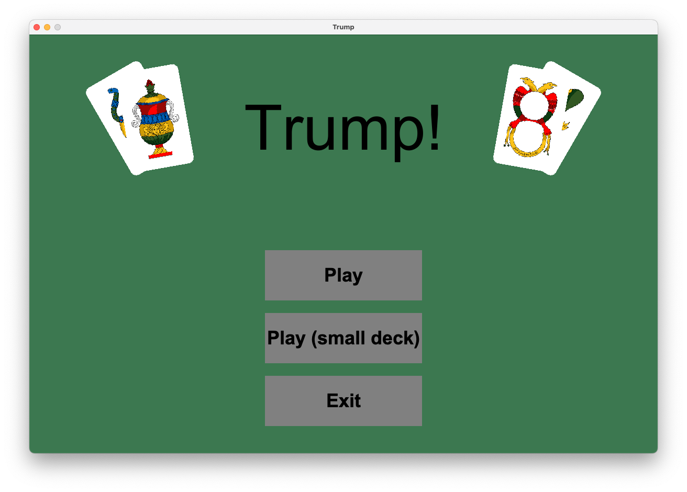
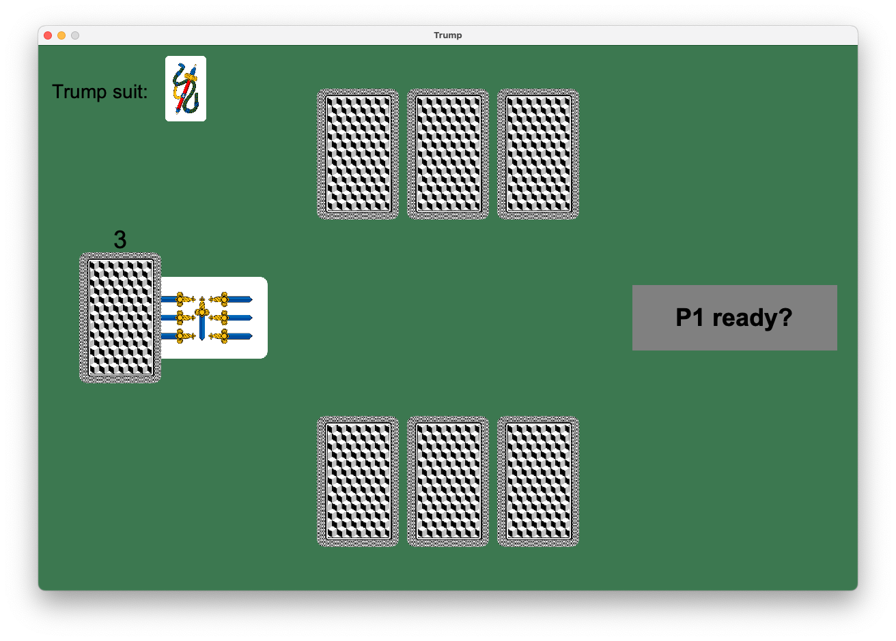
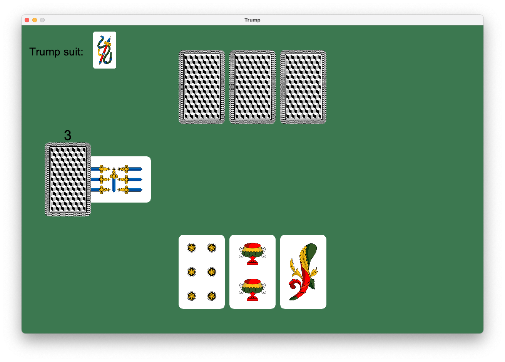
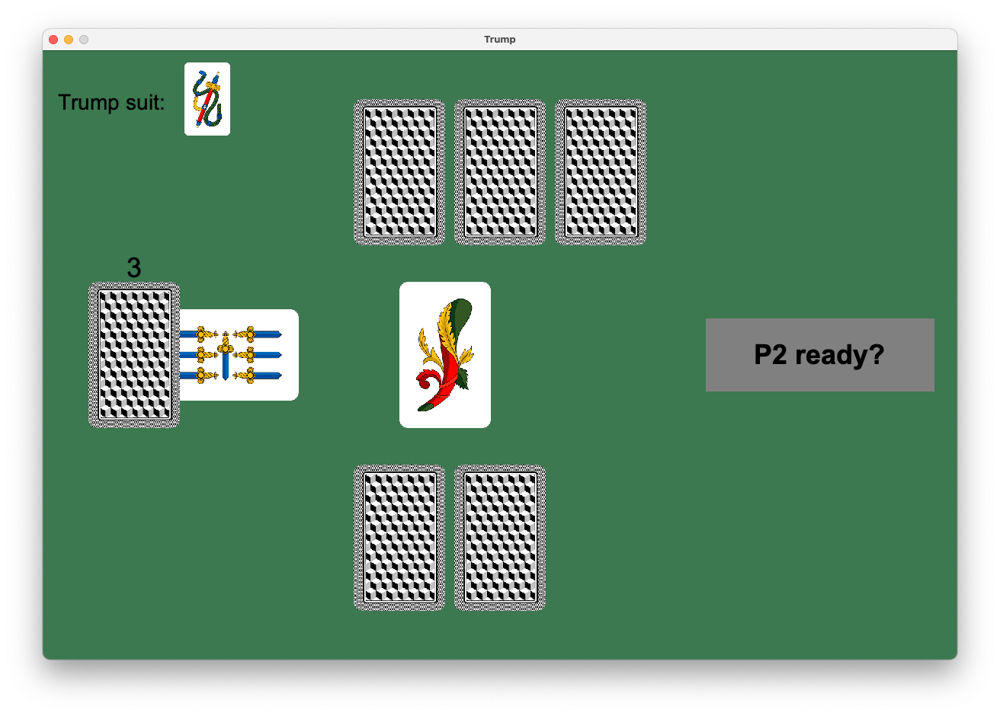
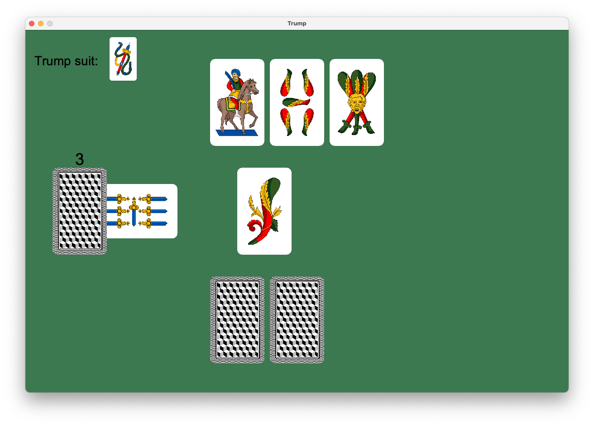
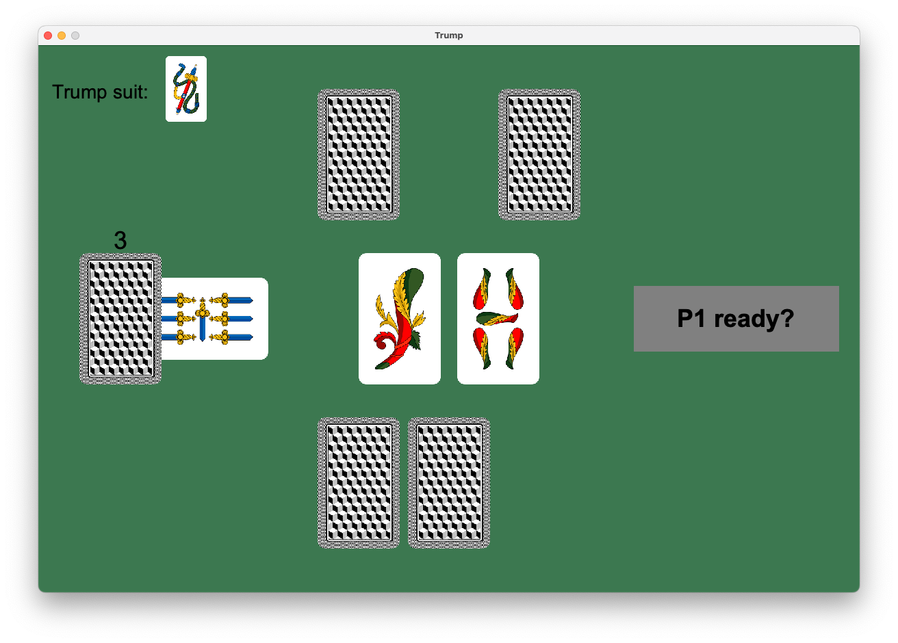
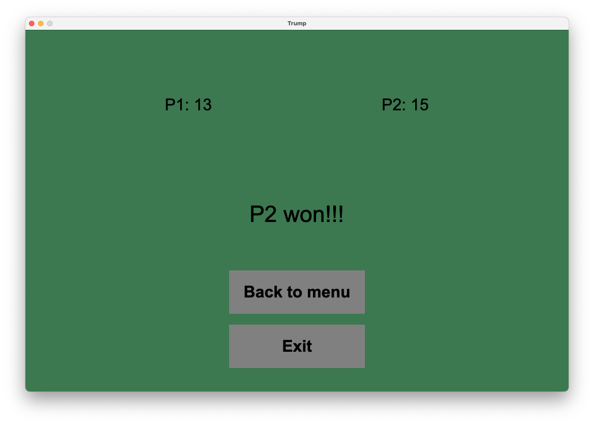

# Briscola (Trump)
Si vuole realizzare il famoso gioco di carte da spiaggia (per due giocatori).

Si è scelto questo gioco in quanto essendo a turni differisce abbastanza dagli altri giochi e questo permette di provare che l'engine sia sufficientemente general purpose.

Inoltre presenta una struttura e una logica di funzionamento moderatamente complessa che dovrebbe consentire di dimostrare le capacità di programmazione funzionale acquisite durante l'insegnamento.

## Risultato
**Menu**:
Qui è possibile iniziare una partita, sia con un deck classico che con uno ridotto (per provare in fretta il gioco)


**Preparazione**:
In questa fase entrambe le mani sono coperte per impedire ai giocatori di vedere la mano altrui, quando il secondo giocatore si è voltato il primo potrà cliccare su "P1 ready?".

In alto a sinistra viene ricordato il seme di briscola, sarà utile soprattutto a fine gioco quando la briscola verrà presa da un giocatore


**Primo turno**:
Ora il primo giocatore può scegliere quale carta giocare e cliccandoci sopra verrà messa sul campo


**Preparazione al secondo turno**:
Ora i giocatori devono scambiarsi, il primo smette di guardare lo schermo e il secondo quando sarà pronto cliccherà su "P2 ready?"


**Secondo turno**:
Ora il secondo giocatore può scegliere quale carta giocare e cliccandoci sopra verrà messa sul campo


**Valutazione del turno**:
Ora entrambi i giocatori possono vedere quali carte sono state giocate (in modo da contarle per fare strategia)


**Risultati**:
Una volta finita la partita si verrà portati ad una pagina con i punteggi e la dichiarazione del vincitore


## Architettura
Si vuole realizzare un cuore funzionale con guscio ad oggetti (dove interfacciarsi con il game engine).
Questo approccio dovrebbe garantire il meglio di entrambi i paradigmi.

Quindi l'intero modello del gioco della briscola è stato realizzato in maniera puramente funzionale. Mentre la parte grafica e di interazione con il giocatore sono state implementate utilizzando l'engine seguendo il paradigma di programmazione orientato agli oggetti.

## Modello funzionale
### [`Cards`](/Trump/src/main/scala/model/Cards.scala)
Le carte di gioco hanno un seme (`Suit`) e un grado (`Rank`).

Il grado determina anche la forza di una carta e il suo valore in punti una volta acquisita dal giocatore.

### [`Decks`](/Trump/src/main/scala/model/Decks.scala)
Si è differenziato un `Deck` da uno `ShuffledDeck`, questo consente di rafforzare attraverso il type system il vincolo di gioco secondo il quale il deck deve essere mischiato prima di iniziare a giocare.

Per ridurre al minimo la duplicazione di codice (siccome un `ShuffledDeck` è sostanzialmente un Deck) si è utilizzata la typeclass `DeckOps` e polimorfismo ad-hoc, aggiungendo il fatto che `ShuffledDeck` è un alias opaco di `Deck` questo permette di utilizzare un'unica implementazione della logica di un `Deck` aggiungendo però questa differenziazione di tipi.

### Monade [`EitherState`](/Trump/src/main/scala/statemonad/EitherState.scala)
L'utilizzo della monade State è molto comodo per semplificare la scrittura di certe operazioni.

```scala
// Per esempio per pescare 3 carte è possibile fare
val dealThreeCards = for
    c1 <- deal()
    c2 <- deal()
    c3 <- deal()
yield (c1, c2, c3)
dealThreeCards.run(deck) match
    case Right(deck, cards) => cards
    case Left(error)        => // handle error
```

Inoltre permette di definire l'intera logica di gioco in [un unico blocco di codice](/Trump/src/main/scala/model/Trump.scala#L225) abbastanza contenuto.

Sono stati effettuati dei cambiamenti alla monade State in modo da consentire non solo cambiamenti di stato ma anche cambiamenti nel tipo dello stato. Questo consente di preparare una computazione che inizia con un `Deck` e finise con uno `ShuffledDeck`.

```scala
// shuffleDeck: EitherState[Deck, ShuffledDeck, Card, TrumpError]
val shuffleDeck =
    for
        _ <- shuffle[Deck]()
        c <- deal()
    yield (c)
// Questo permette di partire con un Deck, mischiarlo rendendolo uno ShuffledDeck e poi pescare una carta.

// Eseguendo questo è possibile quindi ottenere il nuovo deck mischiato dal quale è stata pescata una carta.
shuffleDeck.run(deck)
```

> **Nota:**
>
> E' purtroppo necessario specificare il parametro di tipo `[Deck]` in modo da disambiguare al compilatore l'utilizzo di `DeckOps[Deck]` rispetto a quello di `DeckOps[ShuffledDeck]` (che era invece stato importato). Altrimenti si sarebbe ottenuta una computazione del tipo `EitherState[ShuffledDeck, ShuffledDeck, Card, TrumpError]`

Si sarà inoltre notato che la monade è stata chiamata EitherState, questo perchè la si è modificata per aggiungere un'ulteriore funzionalità, ovvero la gestione di errori.

Infatti è necessario gestire la possibilità di errori di input o di azioni che vanno contro le regole del gioco. In questi casi l'intera computazione entra in uno stato di fallimento restituendo un errore.

```scala
// takeCardFromCurrentPlayerHand potrebbe fallire nel caso in cui la carta in input non fosse effettivamente parte della mano del giocatore corrente. In questo caso è possibile programmare l'intera logica ragionando solo sui casi senza errori, in quanto in caso di errore tutta la computazione verrebbe terminata con quell'errore.
for
    card <- takeCardFromCurrentPlayerHand(card)
    field <- placeCardOnField(card, currentPlayer.info)
    _ <-
    // ...
yield // ...
```

### [`PlayersInfo`](/Trump/src/main/scala/model/PlayersInfo.scala)
`PlayersInfo` funge da struttura dati di input per i dati dei giocatori e funge da loro identificativo.

Per creare un `PlayersInfo` è necessario passare due valori di info diversi altrimenti si riceve un option vuoto.
Questo consente di obbligare lo sviluppatore a gestire la validazione dell'input prima ancora di entrare nella logica applicativa (permettendo quindi al modello di gioco funzionale di poter lavorare senza preoccuparsene).

## GUI
L'obiettivo inizialmente era quello di creare degli oggetti di gioco che semplicemente riflettessero lo stato del modello.

E' però stato necessario in alcune situazioni abbandonare questo approccio per migliorare la giocabilità. Infatti il modello una volta giocata la seconda carta provvede subito ad assegnare il campo al vincitore, questo impediva al primo giocatore di poter vedere quale carta era stata giocata dal secondo.

La soluzione adottata prevede appunto che quando il secondo giocatore gioca la sua carta questa non venga veramente giocata anche nel modello dei dati, ma temporaneamente tenuta da parte in modo da effettivamente giocarla solo alla pressione del bottone che porta al turno successivo.
